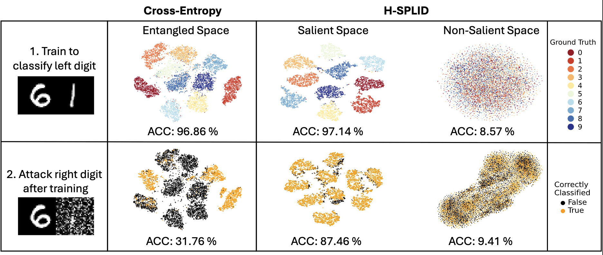

# H-SPLID: HSIC-based Saliency Preserving Latent Information Decomposition
This repository contains the implementation for the paper "H-SPLID: HSIC-based Saliency Preserving Latent Information Decomposition" (NeurIPS 2025).
<p align="center">
    <a href="assets/figures/figure1.png">
        
    </a>
</p>
H-SPLID learns to ignore irrelevant input by decomposing the latent space into salient and non-salient components. <b>Left</b>: A simple diagnostic test for saliency, where the model is trained to classify the left digit (only labels for the left are provided) and it should ignore the right. <b>Middle</b>: A model trained with cross-entropy loss achieves high test accuracy (96.86%) but produces entangled representations, making it sensitive to perturbations on the right digit (accuracy drops to 31.76% under high-magnitude PGD attack). <b>Right</b>: H-SPLID separates the latent space into a salient subspace, which captures class-discriminative structure (ACC 97.14%), and a non-salient subspace, which contains no class-relevant information (ACC 8.57%). This separation enables robustness to perturbations on irrelevant input (ACC 87.46%), showing proper learning of salient features.

## Installation

You can install the project dependencies using either Conda or pip:
```bash
git clone https://github.com/neu-spiral/H-SPLID.git
cd h-splid

# Pip:
python -m venv venv
source venv/bin/activate
pip install -r requirements.txt
# Conda:
conda env create -f environment.yml
conda activate hsplid
```


## Usage

### Training

The main training script can be run with:
```bash
python train.py --config-name=<config_name>
```

Configuration is managed through Hydra, with config files located in the `configs/` directory.

### COCO
*To reproduce the results of our COCO experiments, follow these steps:*

1. **Adapt the configurations to your setup:**

   * Set your Weights & Biases entity (or disable W&B logging) in [configs/user/user.yaml](configs/user/user.yaml).
   * Specify the path for downloading the COCO dataset in [configs/dataset/coco-animals.yaml](configs/dataset/coco-animals.yaml).

2. **Pretrained vanilla model:**

   * **Option A:** Use the provided pretrained model from `assets/models/coco-animals-standard-resnet18.pt`.
   * **Option B:** Train your own vanilla model by running:
      ```bash
      python train.py --config-name=coco_pretrain
      ```
      
      If you train your own model, update the `pretrained_model_path` in [configs/coco_hsplid.yaml](configs/coco_hsplid.yaml) to point to your trained model.

3. **Select and run your experiment:**

   * The experiment can be selected by setting the `experiment` flag in the defaults section of [configs/coco_hsplid.yaml](configs/coco_hsplid.yaml) to one of the experiment configs in `configs/experiment/coco-animals/resnet18/`.
   * Run the experiment:

   ```bash
   python train.py --config-name=coco_hsplid
   ```

4. **Run the attacks** using [configs/coco_attacks.yaml](configs/coco_attacks.yaml):

   * Update W&B settings in the config file.
   * In the `Models` section, list each model's description and path.
   * The script will loop over the specified seeds and compute the averaged results:

   ```bash
   python attacks.py --config-name=coco_attacks
   ```


### ImageNet
*To reproduce the results of our ImageNet experiments, follow these steps:*

1. **Download datasets and benchmarks:**

   * Download the ImageNet-1K dataset and the desired saliency benchmarks (links provided in the paper).

2. **Adapt the configurations to your setup:**

   * Specify the path to the ImageNet-1K dataset in [configs/dataset/imagenet.yaml](configs/dataset/imagenet.yaml).
   * Specify the path to the ImageNet9 dataset in [configs/dataset/imagenet9.yaml](configs/dataset/imagenet9.yaml). You can also select the split you want to use for benchmarking with `transfer.py`.
   * Specify the path to the CounterAnimal dataset in [configs/dataset/counteranimal.yaml](configs/dataset/counteranimal.yaml). You can also select the split you want to use for benchmarking with `transfer.py`.
   * Set your Weights & Biases entity (or disable W&B logging) in [configs/user/user.yaml](configs/user/user.yaml).

3. **Train models**
   - The experiment can be selected by setting the `experiment` flag in the defaults section of [configs/imagenet_hsplid.yaml](configs/imagenet_hsplid.yaml) to one of the experiment configs in `configs/experiment/imagenet/resnet50/`.
   - Run the experiment:

   ```bash
   python train.py --config-name=imagenet_hsplid
   ```

4. **Evaluate models on benchmark datasets:**

   * Set `model_path` in [configs/imagenet_transfer.yaml](configs/imagenet_transfer.yaml) to the desired model path.
   * Set the `dataset` flag in the defaults section to one of the desired datasets: `imagenet9`, `counteranimal` and update the split.
   * Run:

   ```bash
   python transfer.py --config-name=imagenet_transfer
   ```

### ISIC2017
*To reproduce the results of our ISIC2017 experiments, follow these steps:*

1. **Adapt the configurations to your setup:**

   * Set your Weights & Biases entity (or disable W&B logging) in [configs/user/user.yaml](configs/user/user.yaml).
   * Specify the path for the ISIC2017 dataset in [configs/dataset/isic2017.yaml](configs/dataset/isic2017.yaml).

2. **Pretrained vanilla model:**

   * **Option A:** Use the provided pretrained model from `assets/models/isic2017-standard-resnet50.py`.
   * **Option B:** Train your own vanilla model by running:

      ```bash
      python train.py --config-name=isic_pretrain
      ```

   If you train your own model, update the `pretrained_model_path` in [configs/isic_hsplid.yaml](configs/isic_hsplid.yaml) to point to your trained model.

3. **Select and run your experiment:**

   * The experiment can be selected by setting the `experiment` flag in the defaults section of [configs/isic_hsplid.yaml](configs/isic_hsplid.yaml) to one of the experiment configs in `configs/experiment/isic2017/resnet50/`.
   * Run the experiment:

   ```bash
   python train.py --config-name=isic_hsplid
   ```

4. **Run the attacks** using [configs/isic_attacks.yaml](configs/isic_attacks.yaml):

   * Update W&B settings in the config file.
   * In the `Models` section, list each model's description and path.
   * The script will loop over the specified seeds and compute the averaged results:

   ```bash
   python attacks.py --config-name=isic_attacks
   ```

## Citation

If you use this code in your research, please cite (NeuRIPS citation coming soon):

```bibtex
@misc{miklautz2025hsplidhsicbasedsaliencypreserving,
      title={H-SPLID: HSIC-based Saliency Preserving Latent Information Decomposition}, 
      author={Lukas Miklautz and Chengzhi Shi and Andrii Shkabrii and Theodoros Thirimachos Davarakis and Prudence Lam and Claudia Plant and Jennifer Dy and Stratis Ioannidis},
      year={2025},
      eprint={2510.20627},
      archivePrefix={arXiv},
      primaryClass={cs.LG},
      url={https://arxiv.org/abs/2510.20627}, 
}
```
